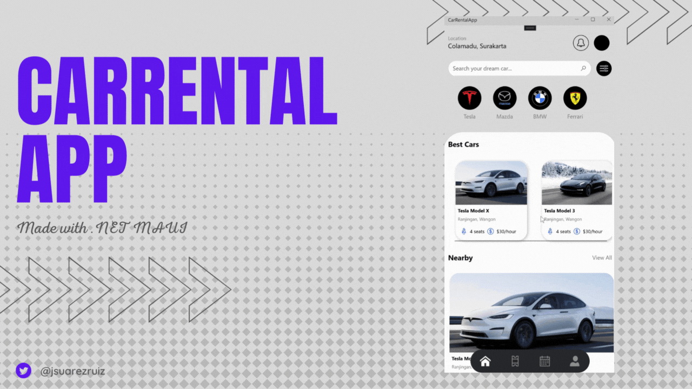

# CarRental App UI Challenge

CarRental App UI Challenge made with .NET MAUI. This example uses the latest version of Evergine that includes .NET MAUI support. More information: https://evergine.com/es/soporte-plantillas-maui/

[Design](https://dribbble.com/shots/19376090-Car-Rental-App-Concept) by Nizar Ali.

Thanks to [Jorge Cantón](https://github.com/Jorgemagic) for contributing to the sample.